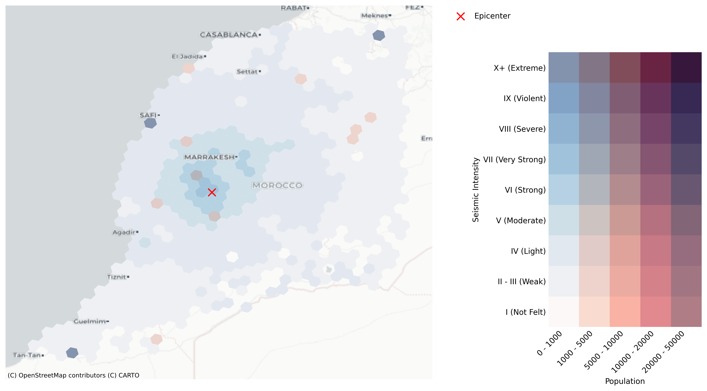

# Humanitarian Map Morocco

This repository contains the code to generate the map of the population in Morocco and the seismic levels at resolution 8 H3 hexagons (~0.73 km2 area).

## Data
The data used in this project are:
- [Morocco: Population Density for 400m H3 Hexagons](https://data.humdata.org/dataset/kontur-population-morocco) from Humanitarian Data Exchange
- [Seismic levels data](https://experience.arcgis.com/experience/c6682b3811894bff9ffcfa58c166d742/page/UNOSAT/?views=Layers) from United Nation Satellite Centre (UNOSAT)

## Requirements
The code is written in Python 3.11.5 and the requirements are listed in the file `requirements.txt`. To install the requirements, run the following command:
```
pip install -r requirements.txt
```

## How to run the code
The `humanitarianMapMorocco.ipynb` contains the code to generate the map

## Results
The map generated is the following:


## License
The code in this repository is licensed under the [MIT License](LICENSE.md).

## Contact
If you have any question, please contact [Claudio Ortega](mailto:claudio.rtega2701@gmail.com).